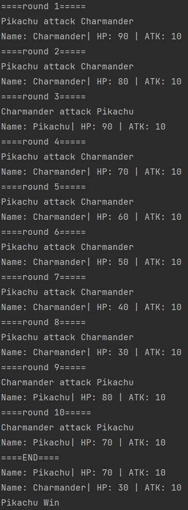

# Pokemon Class

1. ให้เขียน Class Pokemon ใน poke_class.js
   โดย Class Pokemon ต้องรับ Parameter name, hp, atk ถ้าหากไม่ใส่ Parameter ให้กำหนดค่าเริ่มต้น
   name = undefined
   hp = 0
   atk = 0
   และต้องกำหนด hp, atk เป็น private properties
2. และสร้าง method ใน class ดังนี้
   getName ใช้ return Name
   getAtk ใช้ return Atk
   getHp ใช้ return Hp
   setHp ใช้กำหนดค่า Hp
   getInfo ใช้แสดงข้อมูลทั้งหมอของ Class Pokemon
3. ให้เขียน fuction battle ใน main.js
   โดยจะรับ Parameter 2 ตัว ซึ่งเป็น Object Pokemon
   และใน fuction นี้จะต้องนำ Pokemon ทั้งสองมาต่อสู้กัน
   โดยกำหนด รอบการต่อสู้ 10 รอบ และในแต่ละรอบ ให้ทำงานสุ่มเลข 1-10
   ถ้าหากเป็นเลข คู่ ให้ Pokemon ตัวแรก (Parameter ตัวแรก) โจมตี Pokemon ตัวที่สอง (Parameter ตัวที่สอง) และถ้าเป็น คี่ ให้ Pokemon ตัวที่สอง (Parameter ตัวที่สอง) โจมตี Pokemon ตัวแรก (Parameter ตัวแรก) ถ้าหาก Pokemon ตัวไหน hp <= 0 ให้เป็นผ่ายแพ้ หากเท่ากันให้ เสมอ

##### **ตัวอย่างผลลัพธ์**

